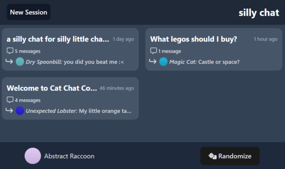
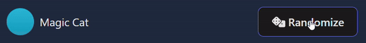
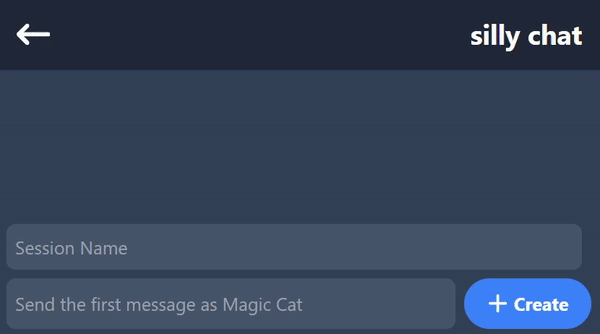
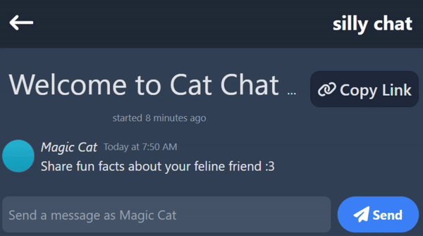

# Sneaky Chat

Sneaky Chat is a lightweight and fun chat application that allows users to engage in public and anonymous conversations without the hassle of creating an account. Embrace the spontaneity of chat sessions with a unique user experience that doesn't require any mandatory registrations.

## Features

-  **Anonymous Chats:** Your sessions are identified by a user-seed stored in your local storage, and a random name is generated based on that seed for added anonymity.

### Sessions

### Randomize Name

### Create Session

### Chat Messages

## Tech Stack

-  **Frontend:** React, Vite, React-Redux
-  **Backend:** Express, Node.js
-  **Database:** MongoDB
-  **Websockets:** Socket.io
-  **Deployment:** Railway.app

## Getting Started

### Prerequisites

Make sure you have Node.js and npm installed on your system.

### To run locally:

-  Duplicate `api/.env.sample`
   -  Change file name to `.env`
   -  Replace placeholder mongoURI, PORT, dbName
-  Duplicate `app/.env.sample`
   -  Change file name to `.env`
   -  Replace placeholder VITE_DB_HOST
-  Run `./install.sh` to install dependencies
-  Run `npm start-dev` to start the frontend & backend
